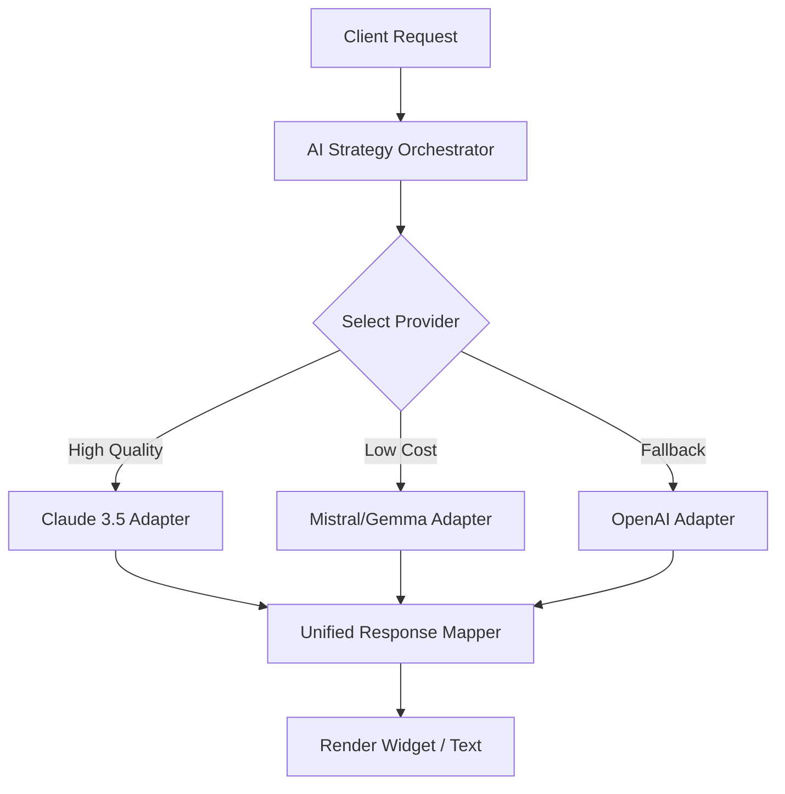

# 🏆 MASTER-GUIDE: Senior Frontend / Product Engineer (Interview Alpha-Bank)

Этот документ — твой ультимативный план подготовки. Здесь каждый пункт твоего резюме разобран до атомов: архитектура, код, бизнес-метрики и "Senior-ловушки".

---

## 🤖 1. AINARI: Опыт в AI и Product Engineering (2025 - н.в.)

### **Архитектурный паттерн: Multi-LLM Orchestration**
**Вопрос:** "Как вы технически организовали работу с 7+ LLM провайдерами?"

**Детальный ответ (Senior):**
Мы внедрили уровень абстракции **Universal AI Gateway**. 
- **Pattern:** Strategy. Каждый провайдер (OpenAI, Anthropic, Gemini, DeepSeek и др.) — это отдельный класс-адаптер.
- **Circuit Breaker:** Если основной провайдер (например, Claude 3.5 Sonnet) возвращает 5xx или превышает таймаут (latency > 5s), оркестратор автоматически переключает запрос на fallback (например, GPT-4o).
- **Abstractions:** Все ответы мапятся в единый интерфейс `UnifiedAIResponse` через DTO-слой.

### **Generative UI через Function Calling**
**Вопрос:** "Как работает рендеринг 'на лету'?"

**Детальный ответ:**
Мы используем **LLM Tools/Functions**. 
1. LLM возвращает `tool_use: { name: 'vocabulary_quiz', arguments: { words: [...] } }`.
2. Фронтенд-роутер (`WidgetRegistry`) сопоставляет `name` с React-компонентом.
3. Данные валидируются через **Zod** перед прокидыванием в пропсы.
**Product Result:** Это позволило AI не просто "говорить", а "строить" обучающий интерфейс в реальном времени.

### **Prefix Caching & Optimization**
**Вопрос:** "Как вы снизили стоимость AI-запросов и задержки (Latency)?"

**Детальный ответ:**
- **Prompt Architecture:** Мы разделили промпт на статическую часть (инструкции, 12 языков) и динамическую (сообщения). 
- **Technique:** Используя возможности провайдеров (вроде Anthropic Prompt Caching), мы кэшируем системные инструкции. 
- **Result:** Это снизило задержку первого токена на **~40%** и стоимость входа на **~25%** для длинных сессий.

---

## 🏦 2. SBERBANK: Масштабируемость и Финтех (2023 - 2025)

### **Микрофронтенды: Event-Driven Communication**
**Вопрос:** "Как вы обеспечили независимость 5+ микрофронтендов?"

**Детальный ответ:**
Мы использовали микрофронтенды для изоляции команд.
- **Communication:** Кастомная шина событий (`window.dispatchEvent` с типизированными `CustomEvent`). Никаких общих сторов (Zustand/Redux) между МФЕ.
- **Shared UI:** Мы использовали платформенный UI-Kit, но версионировали его через `peerDependencies`. Это исключало ситуацию, когда один МФЕ "ломает" другой из-за обновления общей либы.
- **Senior-кейс:** Реализовал изолированный Error Boundary для каждого МФЕ. Если МФЕ "Аренда сейфов" упал — "Вклады" продолжают работать.

### **Backend-Driven UI (BDUI)**
**Вопрос:** "Почему BDUI важен для банка?"

**Детальный ответ:**
Банковские формы (например, оформление вклада) меняются часто (регуляторы, новые условия). 
- **Logic:** Бэкенд возвращает JSON-дерево интерфейса.
- **Frontend:** Рендерит компоненты по `component_id`.
**Бизнес-профит:** Мы выпускали новые типы вкладов за 1 день (Time-to-Market), не дожидаясь релиза в сторы и проходя мимо ревью Apple/Google.

### **React 17 -> 18 Migration**
**Вопрос:** "С какими коллизиями столкнулись при переезде?"

**Детальный ответ:**
Проблема была в **Automatic Batching**. В React 18 апдейты стейта в `setTimeout` или `fetch` начали группироваться. У нас была легаси-логика в "Сейфах", завязанная на синхронные апдейты. 
- **Solution:** Для критических мест временно использовали `flushSync`, пока переписывали компоненты на `useTransition` для конкурентного рендеринга.

---

## 🛡️ 3. ANDERSEN LAB: Сложный стейт и Легаси (2022 - 2023)

### **Динамические калькуляторы (Redux Toolkit)**
**Вопрос:** "Как управлять сотнями зависимых полей?"

**Детальный ответ:**
Это проект **InsureChoice**. 
- **Approach:** Использовали рему `Normalized State`. Рассчитывали страховку через `reselect` (мемоизированные селекторы). 
- **Complexity:** При изменении одного поля (марка авто) должны были "сброситься" или пересчитаться другие 5 (модель, год, цена). Реализовал это через `extraReducers` в RTK, которые слушали `action` изменения мастер-поля.

---

## 🏹 4. BEHAVIORAL: Твои "Факапы" (STAR-метод)

### **"The Ghost in Microfrontends" (Sberbank)**
- **Situation:** Обновили общий хелпер для формата дат. Один МФЕ упал.
- **Task:** Понять, почему упал, если тесты прошли.
- **Action:** Оказалось, что тесты запускались в Node.js среде, а баг проявлялся только в ранних версиях WebView на Android. Я внедрил **Sentry Recording** и **Zod runtime-валидацию** для ВСЕХ входящих данных в хелперах.
- **Result:** С тех пор ни один несовпадающий тип данных не ронял продакшн.

### **"The LLM Bill Shock" (Ainari)**
- **Situation:** Выкатили фичу, юзеры начали "склеивать" огромные контексты в чате. Счет OpenAI вырос в 4 раза за ночь.
- **Action:** Срочно внедрил лимитирование контекста (Sliding Window) и фильтрацию сообщений (Summarization). Настроил мониторинг в **Grafana** с алертом по достижению порога $50/час.
- **Result:** Вернули расходы в норму, внедрили культуру "FinOps" в процесс разработки AI.

### **"The VPS Security Breach" (Ainari / Startup)**
- **Situation:** На старте разработки чат-бота я настраивал тестовый VPS.
- **Task:** Быстро развернуть окружение для MVP.
- **Action:** Из-за спешки установил слабый пароль на SSH и не настроил файрвол. Через день сервер взломали через брутфорс и запустили скрипт для DDoS-атак на сторонние сервисы.
- **Result:** Провайдер заблокировал сервер. Мы потеряли время на пересоздание инстанса и чистку данных.
- **Lesson & Prevention:** Этот случай стал триггером для создания **Security Baseline**: 
    1. Полный отказ от паролей в пользу SSH-ключей. 
    2. Настройка `Fail2Ban` и `UFW`. 
    3. Использование `Docker` для изоляции процессов. 
    **Senior-акцент:** "Теперь для меня безопасность — это часть 'Definition of Done'. Я лучше потрачу лишний час на настройку ролей доступа (IAM/Least Privilege), чем буду чистить прод от малвари."

---

## ⚡ 5. TECH-STACK "SHORTCUTS" ДЛЯ БЛИЦ-ВОПРОСОВ

| Технология | Зачем она была нужна? | Твой "Killer" аргумент |
| :--- | :--- | :--- |
| **Next.js** | B2B SaaS | Перешли с SPA на App Router для SEO и уменьшения бандла на 25%. |
| **TanStack Query** | Сбербанк / Ainari | Ушли от Redux для серверного стейта. Кэширование и автоматический refetch. |
| **Tailwind** | Ainari | Скорость сборки UI выросла в 2 раза за счет отсутствия контекста CSS-файлов. |
| **CI/CD (Dokploy)** | Ainari B2B | Автоматизация деплоя на дешевые VPS с поддержкой Docker-контейнеров. |
| **NestJS** | B2B Gateway | Чтобы фронтенд-команда могла писать надежный бэкенд на знакомом TS. |

---

### 🏆 Финальный совет:
Когда интервьюеры в Альфа-Банке спросят: "Где вы видите себя через год?", отвечай как **Product Engineer**: *"Я хочу видеть, что внедренные мной AI-инструменты сократили Customer Effort Score на 15% и стали стандартом для интерфейсов банка."*
